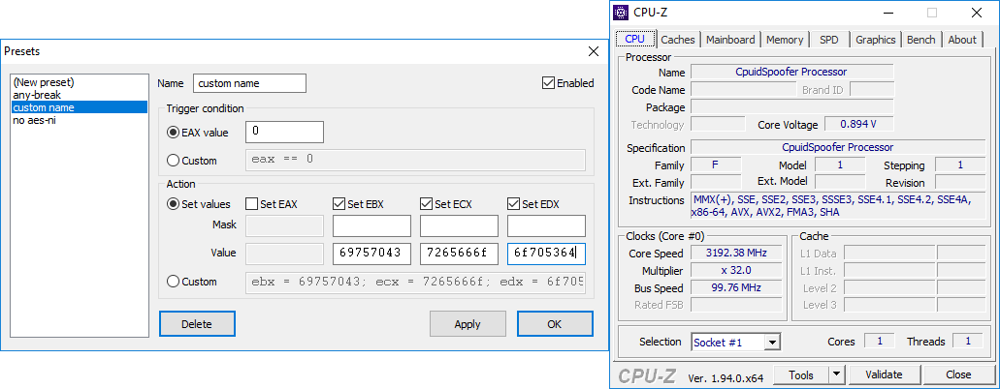

# CPUID Spoofer
CpuidSpoofer is a [x64dbg](https://x64dbg.com/) plugin which helps you to modify the behaviour of the CPUID instruction.

For example, you can easily change the *manufacturer ID string*:

## Installation
1. Go to [Latest Release page](https://github.com/jonatan1024/CpuidSpoofer/releases/latest)
2. Download `CpuidSpoofer.dp64` into `x64dbg\x64\plugins\`
3. Download `CpuidSpoofer.dp32` into `x64dbg\x32\plugins\`

## Usage
Everything is accessible from the top menu bar, under the *Plugins → CPUID* Spoofer submenu.

### Options
The options/presets dialog allows you to prepare various triggers and actions that should happen upon CPUID instruction execution.

These presets are global. They are shared between debugged files.

### Find CPUIDs and set breakpoints
Once the debugged file is fully loaded, breakpoints must be placed onto the CPUID instructions.

Click the convenient *Find CPUIDs and set breakpoints* menu option to automatically place those breakpoints.

Two breakpoints will be created for each CPUID instruciton.
First, directly on the said instr., for trigger evaluation. Second, after the said instr., for action evaluation.

You can place these breakpoints manually by selecting a CPUID instruction in the CPU tab and clicking *Set breakpoint here*.

If you find yourself overwhelmed by the number of breakpoints created, just click on *Remove all breakpoints*.
This will remove both automatically and manually placed breakpoints (by this tool only).

## Advanced usage
This plugin exports two commands: `CpuidSpooferBegin` and `CpuidSpooferEnd`.
When CPUID instruction is found, two breakpoints are created, as described above. Each of them executes one of these exported commands.

The "Begin" command evaluates all triggers from all enabled presets. If the trigger condition is true, preset action is selected to be executed.

The "End" command executes all perviously selected actions.

To break execution during trigger or action evaluation, append `$breakpointcondition=1;` into the *Custom* field.
